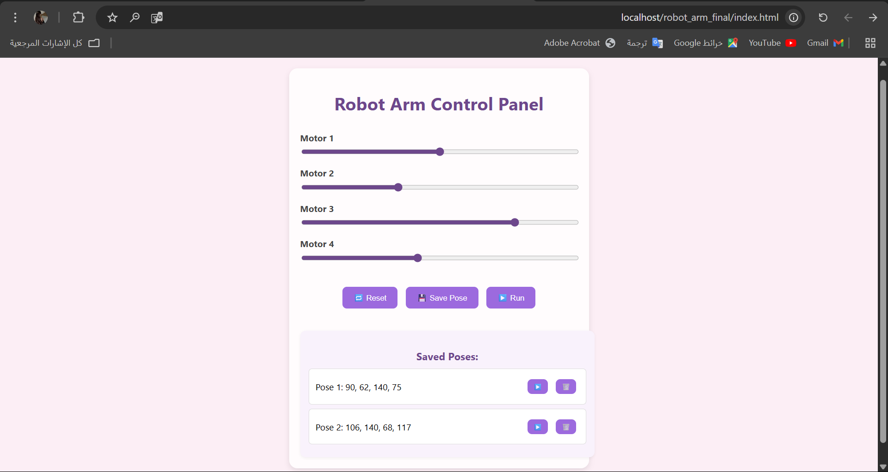

# Robot Arm Control Panel

This web-based interface allows users to control a 4-motor robotic arm using sliders. Users can:

- Adjust motor positions (0–180°) with sliders.
- Save motor positions as named poses.
- View saved poses in a table.
- Run a pose or delete it using the action buttons.

## Technologies Used
- HTML, CSS, JavaScript
- PHP & MySQL (XAMPP)

## Database
- Database name: robot_arm_db
- Table name: poses
- Columns: id, motor1, motor2, motor3, motor4, status

## Screenshot

## Features
- Save Pose: Saves the current motor values into the database.
- Run Pose: (Optional – shows current pose values, can be extended).
- Delete Pose: Removes a pose from the database instantly.
- Reset: Resets all sliders to 90°.

## File Structure
robot_arm_final/
├── index.html  
├── style.css  
├── script.js  
├── db.php  
├── insert.php  
├── fetch.php  
├── update_status.php  
├── get_run_pose.php  
└── images/  
    └── robot_arm_interface.png

## Notes
- Use XAMPP and place the folder inside `htdocs`.
- Access via: http://localhost/robot_arm_final